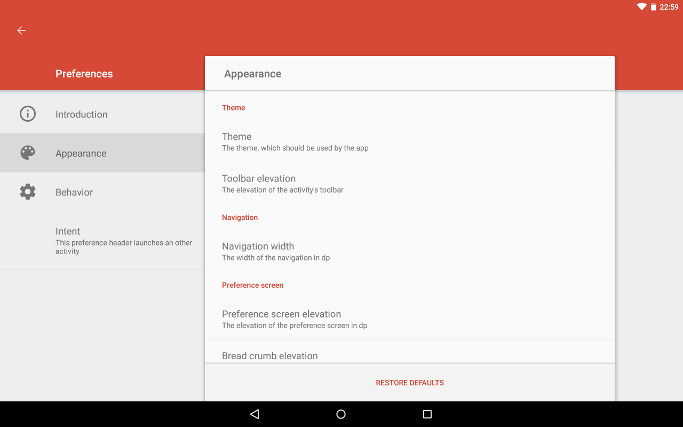
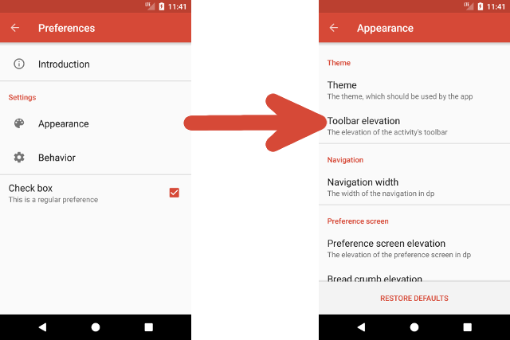
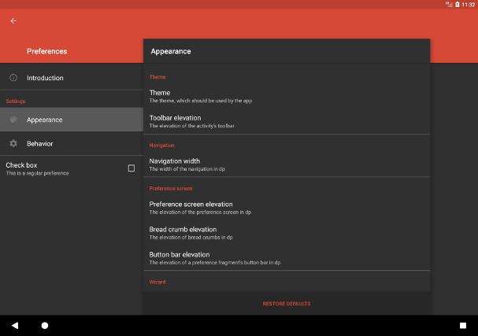
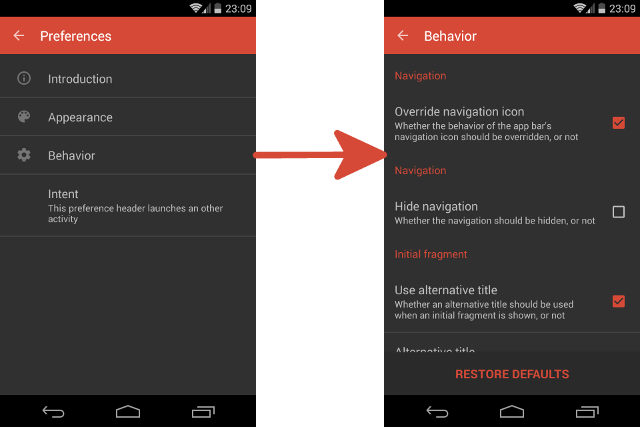

# AndroidPreferenceActivity - README

[](https://android-arsenal.com/api?level=14) [](https://opensource.org/licenses/Apache-2.0) [](https://www.paypal.com/cgi-bin/webscr?cmd=_s-xclick&hosted_button_id=X75YSLEJV3DWE)

"AndroidPreferenceActivity" is an Android-library, which provides an alternative implementation of the Android SDK's built-in `PreferenceActivity`. Such an activity provides a visualization of categorized preferences. The appearance of the activity varies depending on the size of the device's display. On devices with small screens, e.g. on smartphones, the navigation is designed to use the whole available space and selecting a navigation item causes the corresponding preferences to be shown full screen as well. On devices with large screens, e.g. on tablets, the navigation and the preferences of the currently selected navigation item are shown split screen instead. The library's `PreferenceActivity` provides the ability to use the activity as a wizard and to add or remove navigation items dynamically at runtime. The activity's UI is designed according to the Android 5 "Material Design" guidelines (even on pre-Lollipop devices). The screenshot below illustrates the default appearance of the activity on a tablet.



The screenshots below show the appearance of the library's `PreferenceActivity` when used on a smartphone:



The library provides the following features:

- The activity's navigation allows to show items, which categorize the preferences of a `PreferenceFragment`. Furthermore, regular fragments can be shown. Besides a title, the preference headers may contain an icon and a summary.
- Besides `NavigationPreferences`, which allow to navigate to a `Fragment` when clicked, arbitrary preferences can be contained by the navigation. Preferences can also be added or removed dynamically at runtime, which causes the currently selected navigation item be adapted automatically.
- The activity provides methods, which easily allow to access its child views in order to manipulate their appearance. For the most common manipulations dedicated methods exist.
- The library allows to override the behavior of the toolbar's back button in order to use it for navigating on devices with a small screen.
- It is possible to launch the activity using an `Intent`, which specifies the navigation item, which should be initially selected. Such an `Intent` also allows to customize the activity's appearance and behavior in additional ways, e.g. it is possible to hide the navigation.
- It is also possible to use the activity as a wizard, This causes an alternative navigation to be used, which allows to switch from one step of the wizard to an other. The navigation can be observed and influenced by implementing and registering an appropriate listener.
- The UI has been designed according to the "Material Design" guidelines. Material Design is even used on pre-Lollipop devices (API level less than 21).

## License Agreement

This project is distributed under the Apache License version 2.0. For further information about this license agreement's content please refer to its full version, which is available at http://www.apache.org/licenses/LICENSE-2.0.txt.

Prior to version 4.0.7 this library was distributed under the GNU Lesser General Public License version 3.0 (GLPLv3).

## Download

The latest release of this library can be downloaded as a zip archive from the download section of the project's Github page, which is available [here](https://github.com/michael-rapp/AndroidPreferenceActivity/releases). Furthermore, the library's source code is available as a Git repository, which can be cloned using the URL https://github.com/michael-rapp/AndroidPreferenceActivity.git.

Alternatively, the library can be added to your Android app as a Gradle dependency by adding the following to the respective module's `build.gradle` file:

```groovy
dependencies {
    compile 'com.github.michael-rapp:android-preference-activity:5.0.0'
}
```

Before version 3.0.0 this project was hosted on [Sourceforge](https://sourceforge.net/projects/androidpreferenceactivity). These older versions used the legacy Eclipse ADT folder structure and are not available as Gradle artifacts.

## Examples

The following examples provide a quick overview on how to use the `PreferenceActivity`, which is provided by the library. This project also contains the source code of an example app, which implements an use case of the library for demonstration purposes, as well as auto-generated javadoc files.

### Specifying and adding navigation items

The navigation items, which allow to navigate to fragments, are represented by instances of the class `NavigationPreference`. However, the navigation may also contain arbitrary preferences. The XML code below shows how to declare the preferences of a navigation within a XML resource. The file should be placed inside the folder `res/xml`.

```xml
<?xml version="1.0" encoding="utf-8"?> 
<PreferenceScreen xmlns:android="http://schemas.android.com/apk/res/android">

    <de.mrapp.android.preference.activity.NavigationPreference
        android:fragment="de.mrapp.android.preference.activity.example.fragment.IntroductionPreferenceFragment"
        android:icon="@drawable/introduction_icon"
        android:title="@string/introduction_navigation_preference_title"/>

    <PreferenceCategory android:title="@string/settings_category">

        <de.mrapp.android.preference.activity.NavigationPreference
            android:fragment="de.mrapp.android.preference.activity.example.fragment.AppearancePreferenceFragment"
            android:icon="@drawable/appearance_icon"
            android:key="@string/appearance_navigation_preference_key"
            android:title="@string/appearance_navigation_preference_title"/>

        <de.mrapp.android.preference.activity.NavigationPreference
            android:fragment="de.mrapp.android.preference.activity.example.fragment.BehaviorPreferenceFragment"
            android:icon="@drawable/behavior_icon"
            android:key="@string/behavior_navigation_preference_key"
            android:title="@string/behavior_navigation_preference_title"/>

    </PreferenceCategory>

    <PreferenceCategory>

        <CheckBoxPreference
            android:summary="@string/check_box_preference_summary"
            android:title="@string/check_box_preference_title"/>

    </PreferenceCategory>

</PreferenceScreen>
```

As seen in the example above, it is possible to specify a fragment, which should be shown when a `NavigationPreference` becomes selected. The fragments must be specified by giving fully classified class names.

To add preferences to a `PreferenceActivity`, the method `onCreateNavigation` must be overridden. The example below illustrates how the preferences, which are contained by a XML file, can be used. However, it is also possible to add the individual preferences programmatically.

```java
public class PreferenceActivity extends de.mrapp.android.preference.PreferenceActivity { 

    @Override 
    protected final void onCreateNavivation(android.preference.PreferenceFragment fragment) { 
        fragment.addPreferencesFromResource(R.xml.navigation); 
    } 

}
```

### Specifying the activity's theme

The library comes with a predefined dark and light theme. The dark theme can be referenced using the resource id `@style/PreferenceActivity` and the light theme corresponds to the resource id `@style/PreferenceActivity.Light`. The following example shows how the appearance of a `PreferenceActivity` can be easily adapted by assigning one of these themes in the app's `AndroidManifest.xml` file.
 
```xml
<activity
    android:name="com.example.PreferenceActivity"
    android:label="@string/preference_activity_title"
    android:theme="@style/PreferenceActivity"/>
```

Furthermore, it might be useful to extend one of the predefined themes in order to overwrite some of its attributes. For example, it is a common use-case to overwrite the attributes `colorPrimary` and `colorAccent`, which are used to specify the colors of the activity's toolbar and widgets. In such case, a new style resource, which extends one of the built-in themes, must be added to your app's `res/values/styles.xml` file. Its resource id must then be used to specify the activity's theme in the `AndroidManifest.xml` file as shown above. The following example illustrates how a custom style can be defined:

```xml
<resources>

    <style name="CustomPreferenceActivity" parent="@style/PreferenceActivity">
        <item name="colorPrimary">@color/color_primary</item>
        <item name="colorPrimaryDark">@color/color_primary_dark</item>
        <item name="colorAccent">@color/color_accent</item>
    </style>

</resources>
```

The screenshots below show the appearance of a `PreferenceActivity`, when using the dark theme:





## Troubleshooting

This library is incompatible with the [v7 Preference Support Library](https://developer.android.com/topic/libraries/support-library/features.html#v7-preference). Using both libraries together in one project may result in unexpected behavior, e.g. the preferences may become unclickable (see [this](https://github.com/michael-rapp/AndroidPreferenceActivity/issues/19) issue).

## Contact information

For personal feedback or questions feel free to contact me via the mail address, which is mentioned on my [Github profile](https://github.com/michael-rapp). If you have found any bugs or want to post a feature request please use the [bugtracker](https://github.com/michael-rapp/AndroidPreferenceActivity/issues) to report them.
