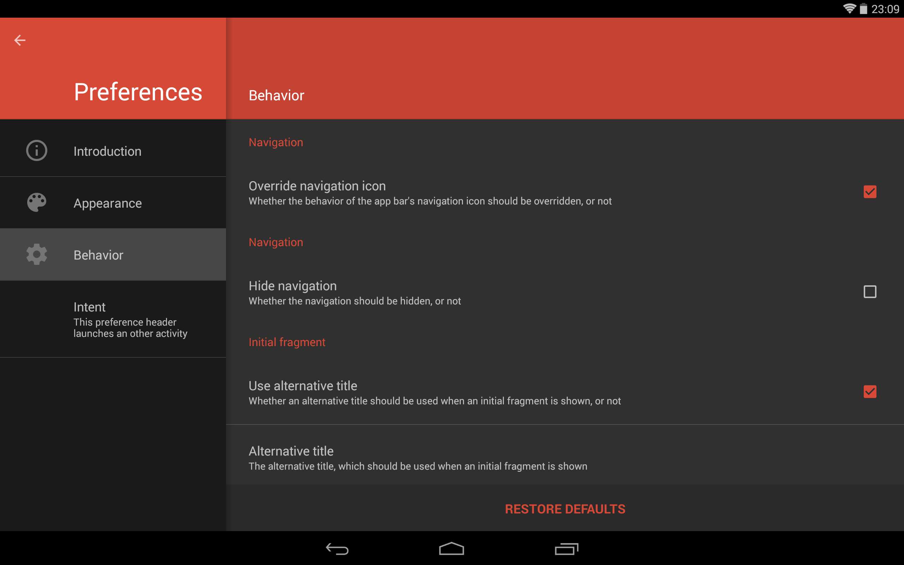

# AndroidPreferenceActivity - README

"AndroidPreferenceActivity" is an Android-library, which provides an alternative implementation of the Android SDK's built-in `PreferenceActivity`. Such an activity provides a visualization of categorized preferences. The appearance of the activity varies depending on the size of the device's display. On devices with small screens, e.g. on smartphones, the navigation is designed to use the whole available space and selecting an item causes the corresponding preferences to be shown full screen as well. On devices with large screens, e.g. on tablets, the navigation and the preferences of the currently selected item are shown split screen instead. Although the library's API is designed to be similar to the API of the Android SDK's `PreferenceActivity`, it provides additional possibilities, beyond the functionalities of the original. This includes easier adaption of the activity's appearance, as well as the possibility to use the activity as a wizard and to add or remove the activity's preference headers dynamically at runtime. Since version 2.0.0 the activity's UI is designed according to the Android 5 "Material Design" guidelines (even on pre-Lollipop devices). The screenshot below illustrates the default appearance of the activity, which is provided by the library, on a tablet.


The screenshots below show the appearance of the library's `PreferenceActivity` when used on a smartphone:


The library provides the following features:

- The activity's navigation allows to show preference headers, which categorize the preferences of a `PreferenceFragment`. Furthermore, regular fragments can be shown. Besides a title, the preference headers may contain an icon and a summary and it is possible to launch an intent when a header is selected.
- The activity's preference headers can be defined via XML resources, which are compatible to the ones used to initialize the Android SDK's built-in `PreferenceActivity`. Alternatively, the preference headers can be added or removed dynamically at runtime, which causes the current selected preference header to be adapted automatically.
- The activity provides methods, which easily allow to access its child views in order to manipulate their appearance. For the most common manipulations even dedicated methods exist.
- The library allows to override the behavior of the action bar's back button in order to use it for navigating on devices with a small screen.
- It is possible to launch the activity using an `Intent`, which specifies the preference header, which should be initially selected. Such an `Intent` also allows to hide the navigation.
- By specifying appropriate `Intent` extras, it is also possible to use the activity as a wizard, which provides an alternative navigation, which allows to navigate from one step of the wizard to an other. The navigation can be observed and influenced by implementing and registering an appropriate listener.
- The UI has been designed according to the Android 5 "Material Design" guidelines. Material Design is even used on pre-Lollipop devices (API level less than 21).

## License Agreement

This project is distributed under the Apache License version 2.0. For further information about this license agreement's content please refer to its full version, which is available at http://www.apache.org/licenses/LICENSE-2.0.txt.

Prior to version 4.0.7 this library was distributed under the GNU Lesser General Public License version 3.0 (GLPLv3).

## Download

The latest release of this library can be downloaded as a zip archive from the download section of the project's Github page, which is available [here](https://github.com/michael-rapp/AndroidPreferenceActivity/releases). Furthermore, the library's source code is available as a Git repository, which can be cloned using the URL https://github.com/michael-rapp/AndroidPreferenceActivity.git.

Alternatively, the library can be added to your Android app as a Gradle dependency by adding the following to the respective module's `build.gradle` file:

```groovy
dependencies {
    compile 'com.github.michael-rapp:android-preference-activity:4.2.3'
}
```

Before version 3.0.0 this project was hosted on [Sourceforge](https://sourceforge.net/projects/androidpreferenceactivity). These older versions used the legacy Eclipse ADT folder structure and are not available as Gradle artifacts.

## Examples

The following examples provide a quick overview on how to use the activity, which is provided by the library, in your own Android app. This project also contains the source code of an example app, which implements an use case of the library for demonstration purposes, as well as a more detailed documentation and auto-generated javadoc files.

### Specifying and adding preference headers

The XML code below shows how to declare multiple preference headers within a XML resource.

```xml
<?xml version="1.0" encoding="utf-8"?> 
<preference-headers xmlns:android="http://schemas.android.com/apk/res/android" 

    <header 
        android:breadCrumbShortTitle="breadCrumbShortTitle" 
        android:breadCrumbTitle="breadCrumbTitle" 
        android:fragment="com.something.Fragment" 
        android:summary="summary" 
        android:title="title" /> 

    <header android:title="title" > 
        <intent 
            android:targetClass="com.something.Activity" 
            android:targetPackage="com.something" /> 

        <extra 
            android:name="key" 
            android:value="value" /> 

    <header 
        android:breadCrumbShortTitle="@string/breadCrumbShortTitle" 
        android:breadCrumbTitle="@string/breadCrumbTitle" 
        android:icon="@android:drawable/ic_delete" 
        android:summary="@string/summary" 
        android:title="@string/title" /> 

</preference-headers>
```

As seen in the example above, it is possible to specify a fragment, which should be shown when the appropriate preference header becomes selected, as well as an intent, which is used to launch an activity when the preference header is selected. These two possibilites can also be used together.

The Java code below shows how the class `PreferenceActivity` can be extended to create an activity whose preference headers are loaded at startup from the XML resource shown above:

```java
public class PreferenceActivity extends de.mrapp.android.preference.PreferenceActivity { 

    @Override 
    protected final void onCreatePreferenceHeaders() { 
        addPreferenceHeadersFromResource(R.xml.preference_headers); 
    } 

}
```

### Specifying the activity's theme

The library comes with a predefined dark and light theme. The dark theme can be referenced using the resource ID `@style/PreferenceActivity` and the light theme corresponds to the resource ID `@style/PreferenceActivity.Light`. The following example shows how the appearance of a `PreferenceActivity` can be easily adapted by assigning either one of these themes in the app's `AndroidManifest.xml` file.
 
```xml
<activity
    android:name="com.example.PreferenceActivity"
    android:label="@string/preference_activity_title"
    android:theme="@style/PreferenceActivity"/>
```

Furthermore, it might be useful to extend one of the predefined themes in order to overwrite some of its theme attributes. For example, it is a common use-case to overwrite the attributes `colorPrimary` and `colorAccent`, which are used to specify the colors of the activity's toolbar and widgets. In such case, a new style resource, which extends one of the built-in themes, must be added to your app's `res/values/styles.xml` file. Its resource ID must then be used to specify the activity's theme in the `AndroidManifest.xml` file like shown above. The following example illustrates how a custom style can be defined:

```xml
<resources>

    <style name="CustomPreferenceActivity" parent="@style/PreferenceActivity">
        <item name="colorPrimary">@color/color_primary</item>
        <item name="colorPrimaryDark">@color/color_primary_dark</item>
        <item name="colorAccent">@color/color_accent</item>
    </style>

</resources>
```

The screenshots below show the appearance of a `PreferenceActivity`, when the dark theme has been applied:




## Contact information

For personal feedback or questions feel free to contact me via the mail address, which is mentioned on my [Github profile](https://github.com/michael-rapp). If you have found any bugs or want to post a feature request please use the [bugtracker](https://github.com/michael-rapp/AndroidPreferenceActivity/issues) to report them.
