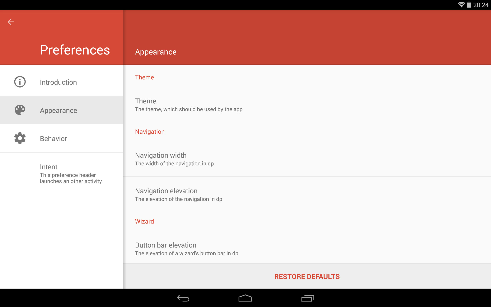
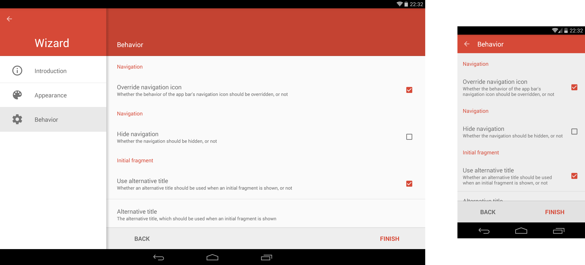

# AndroidPreferenceActivity - README

[](https://android-arsenal.com/api?level=14) [](https://opensource.org/licenses/Apache-2.0) [](https://www.paypal.com/cgi-bin/webscr?cmd=_s-xclick&hosted_button_id=X75YSLEJV3DWE)

"AndroidPreferenceActivity" is an Android-library, which provides an alternative implementation of the Android SDK's built-in `PreferenceActivity`. Such an activity provides a visualization of categorized preferences. The appearance of the activity varies depending on the size of the device's display. On devices with small screens, e.g. on smartphones, the navigation is designed to use the whole available space and selecting a navigation item causes the corresponding preferences to be shown full screen as well. On devices with large screens, e.g. on tablets, the navigation and the preferences of the currently selected navigation item are shown split screen instead. The library's `PreferenceActivity` provides the ability to use the activity as a wizard and to add or remove navigation items dynamically at runtime. The activity's UI is designed according to the Android 5 "Material Design" guidelines (even on pre-Lollipop devices). The screenshot below illustrates the default appearance of the activity on a tablet.



The screenshots below show the appearance of the library's `PreferenceActivity` when used on a smartphone:


The library provides the following features:

- The activity's navigation allows to show items, which categorize the preferences of a `PreferenceFragment`. Furthermore, regular fragments can be shown. Besides a title, the preference headers may contain an icon and a summary.
- Besides `NavigationPreferences`, which allow to navigate to a `Fragment` when clicked, arbitrary preferences can be contained by the navigation. Preferences can also be added or removed dynamically at runtime, which causes the currently selected navigation item be adapted automatically.
- The activity provides methods, which easily allow to access its child views in order to manipulate their appearance. For the most common manipulations dedicated methods exist.
- The library allows to override the behavior of the toolbar's back button in order to use it for navigating on devices with a small screen.
- It is possible to launch the activity using an `Intent`, which specifies the navigation item, which should be initially selected. Such an `Intent` also allows to customize the activity's appearance and behavior in additional ways, e.g. it is possible to hide the navigation.
- It is also possible to use the activity as a wizard, This causes an alternative navigation to be used, which allows to switch from one step of the wizard to an other. The navigation can be observed and influenced by implementing and registering an appropriate listener.
- The UI has been designed according to the "Material Design" guidelines. Material Design is even used on pre-Lollipop devices (API level less than 21).

Prior to version 6.0.0 this library relied on the Android SDK's preference classes such as `android.preference.Preference`. As these classes are deprecated starting with Android P, the library has been migrated to use the v14 Preference support library in version 6.0.0 and later.

## License Agreement

This project is distributed under the Apache License version 2.0. For further information about this license agreement's content please refer to its full version, which is available at http://www.apache.org/licenses/LICENSE-2.0.txt.

Prior to version 4.0.7 this library was distributed under the GNU Lesser General Public License version 3.0 (GLPLv3).

## Download

The latest release of this library can be downloaded as a zip archive from the download section of the project's Github page, which is available [here](https://github.com/michael-rapp/AndroidPreferenceActivity/releases). Furthermore, the library's source code is available as a Git repository, which can be cloned using the URL https://github.com/michael-rapp/AndroidPreferenceActivity.git.

Alternatively, the library can be added to your Android app as a Gradle dependency by adding the following to the respective module's `build.gradle` file:

```groovy
dependencies {
    implementation 'com.github.michael-rapp:android-preference-activity:6.0.3'
}
```

Before version 3.0.0 this project was hosted on [Sourceforge](https://sourceforge.net/projects/androidpreferenceactivity). These older versions used the legacy Eclipse ADT folder structure and are not available as Gradle artifacts.

## Examples

The following examples provide a quick overview on how to use the `PreferenceActivity`, which is provided by the library. This project also contains the source code of an example app, which implements an use case of the library for demonstration purposes, as well as auto-generated javadoc files.

### Specifying and adding navigation items

The navigation items, which allow to navigate to fragments, are represented by instances of the class `NavigationPreference`. However, the navigation may also contain arbitrary preferences. The XML code below shows how to declare the preferences of a navigation within a XML resource. The file should be placed inside the folder `res/xml`.

```xml
<?xml version="1.0" encoding="utf-8"?> 
<PreferenceScreen xmlns:android="http://schemas.android.com/apk/res/android">

    <de.mrapp.android.preference.activity.NavigationPreference
        android:fragment="de.mrapp.android.preference.activity.example.fragment.IntroductionPreferenceFragment"
        android:breadCrumb="@string/introduction_bread_crumb"
        android:summary="@string/introduction_summary"
        android:icon="@drawable/introduction_icon"
        android:title="@string/introduction_navigation_preference_title"/>

    <!-- Allows to categorize multiple preferences -->
    <PreferenceCategory android:title="@string/settings_category">

        <de.mrapp.android.preference.activity.NavigationPreference
            android:fragment="de.mrapp.android.preference.activity.example.fragment.AppearancePreferenceFragment"
            android:icon="@drawable/appearance_icon"
            android:key="@string/appearance_navigation_preference_key"
            android:title="@string/appearance_navigation_preference_title"/>

        <de.mrapp.android.preference.activity.NavigationPreference
            android:fragment="de.mrapp.android.preference.activity.example.fragment.BehaviorPreferenceFragment"
            android:icon="@drawable/behavior_icon"
            android:key="@string/behavior_navigation_preference_key"
            android:title="@string/behavior_navigation_preference_title"/>

    </PreferenceCategory>

    <PreferenceCategory>

        <!-- The navigation may also contain regular preferences -->
        <CheckBoxPreference
            android:summary="@string/check_box_preference_summary"
            android:title="@string/check_box_preference_title"/>

    </PreferenceCategory>

</PreferenceScreen>
```

As seen in the example above, it is possible to specify a fragment, which should be shown when a `NavigationPreference` becomes selected via the attribute `android:fragment`. The fragments must be specified by giving fully classified class names. The attribute `android:title` specifies the title, which is shown in the navigation. The `android:summary` attribute allows to specify a description, which is shown below the title respectively. Furthermore, by giving an `android:icon` attribute, an icon can be set and the attribute `android:breadCrumb` allows to set a title, which is displayed instead of the default title at the top of the screen, when the navigation item is selected.

To add preferences to a `PreferenceActivity`, the method `onCreateNavigation` must be overridden. The example below illustrates how the preferences, which are contained by a XML file, can be used. However, it is also possible to add the individual preferences programmatically.

```java
public class PreferenceActivity extends de.mrapp.android.preference.PreferenceActivity { 

    @Override 
    protected final void onCreateNavivation(android.preference.PreferenceFragment fragment) { 
        fragment.addPreferencesFromResource(R.xml.navigation); 
    } 

}
```

The class `PreferenceActivity` provides useful methods for retrieving information about the `NavigationPreference`s it contains. For example, the `getAllNavigationPreferences`-method allows to retrieve a list of all currently contained `ǸavigationPreferences`. If it is necessary to reference a preference of a different type, the `findPreference`-method of the `android.preference.PreferenceFragment`, which is returned by the `getNavigationFragment`-method, can be used. Furthermore, the `getPreferenceFragment`-method allows to retrieve the currently shown preference fragment, i.e. the fragment that is associated with the currently selected `NavigationPreference`.

### Using themes

The library comes with a predefined dark and light theme. The dark theme can be referenced using the resource id `@style/PreferenceActivity` and the light theme corresponds to the resource id `@style/PreferenceActivity.Light`. The following example shows how the appearance of a `PreferenceActivity` can be easily adapted by assigning one of these themes in the app's `AndroidManifest.xml` file.
 
```xml
<activity
    android:name="com.example.PreferenceActivity"
    android:label="@string/preference_activity_title"
    android:theme="@style/PreferenceActivity"/>
```

Furthermore, it might be useful to extend one of the predefined themes in order to overwrite some of its attributes. For example, it is a common use-case to overwrite the attributes `colorPrimary` and `colorAccent`, which are used to specify the colors of the activity's toolbar and widgets. In such case, a new style resource, which extends one of the built-in themes, must be added to your app's `res/values/styles.xml` file. Its resource id must then be used to specify the activity's theme in the `AndroidManifest.xml` file as shown above. The following example illustrates how a custom style can be defined:

```xml
<resources>

    <style name="CustomPreferenceActivity" parent="@style/PreferenceActivity">
        <item name="colorPrimary">@color/color_primary</item>
        <item name="colorPrimaryDark">@color/color_primary_dark</item>
        <item name="colorAccent">@color/color_accent</item>
        <item name="useSplitScreen">true</item>
        <!-- For more attributes see table(s) below -->
    </style>

</resources>
```

The screenshots below show the appearance of a `PreferenceActivity`, when using the dark theme:


When extending one of the predefined themes, various theme attributes can be used to customize the appearance of a `PreferenceActivity`. Most importantly, dedicated themes can be used for the toolbars, which are contained by such activity. The following table provides an overview of the theme attributes, which are available to do so.

 | Attribute name           | Format    | Description                                                                                                                                                                       |
|--------------------------|-----------|-----------------------------------------------------------------------------------------------------------------------------------------------------------------------------------|
| `toolbarTheme`             | reference | The theme, which should be applied to the toolbar, which displays the activity's title                                                                                            |
| `toolbarPopupTheme`        | reference | The theme, which should be applied to the popup of the toolbar, which displays the activity's title                                                                               |
| `inverseToolbarTheme`      | reference | The theme, which should be applied to the toolbar, which displays the bread crumb of the currently selected `NavigationPreference`, when using the split screen layout.             |
| `inverseToolbarPopupTheme` | reference | The theme, which should be applied to the popup of the toolbar, which displays the bread crumb of the currently selected `NavigationPreference`, when using the split screen layout |

In addition to specifying themes to be used for a `PreferenceActivity`'s toolbars, additional theme attributes exist for customizing the appearance of various UI elements. They are given in the table below.

| Attribute name            | Format          | Description                                                                                                                                                               |
|---------------------------|-----------------|---------------------------------------------------------------------------------------------------------------------------------------------------------------------------|
| `useSplitScreen`            | boolean         | Whether the split screen layout should be used on tablets, or not                                                                                                         |
| `navigationWidth`           | dimension       | The width of the navigation when using the split screen layout                                                                                                            |
| `hideNavigation`            | boolean         | Wether the navigation should be hidden                                                                                                                                    |
| `overrideNavigationIcon`    | boolean         | When set to true, clicking the toolbar's back button, while a navigation item is selected and the split screen layout is not used, brings the user back to the navigation |
| `hideBreadCrumb`            | boolean         | Whether the toolbar, which displays the bread crumb of the currently selected `NavigationPreference`, when using the split screen layout, should be hidden                  |
| `toolbarElevation`          | dimension       | The elevation of the toolbar, which displays the activity's title                                                                                                         |
| `breadCrumbElevation`       | dimension       | The elevation of the toolbar, which displays the bread crumb of the currently selected `NavigationPreference`, when using the split screen layout                          |
| `cardViewElevation`         | dimension       | The elevation of the `CardView`, which contains the currently shown fragment, when using the split screen layout                                                            |
| `cardViewBackgroundColor`   | color           | The background color of the `CardView`, which contains the currently shown fragment, when using the split screen layout                                                     |
| `breadCrumbBackgroundColor` | color           | The background color of the toolbar, which displays the bread crumb of the currently selected `NavigationPreference`, when using the split screen layout                    |
| `navigationBackground`      | color/reference | The background of the navigation. When not using the split screen layout, this is the overall background of the activity                                                  |
| `navigationSelectionColor`  | color           | The background color of the currently selected navigation item                                                                                                            |
| `navigationDividerColor`    | color           | The colors of the dividers, which are contained by the navigation                                                                                                         |

For retrieving or setting the properties mentioned above, the class `PreferenceActivity` also provides getter and setter methods. 

### Using the activity as a wizard

The library's `PreferenceActivity` can also be used as a wizard, which causes the navigation to be replaced by a different one, which provides additional buttons to step to the next or previous `NavigationPreference`. When not using the split screen layout, this causes the navigation to become completely hidden. When using the split screen layout, the left-hand navigation will become unsensitive for clicking individual items. The following screenshots illustrate the appearance of such a wizard on tablets, respectively on smartphones:



There a different ways to specify, that a `PreferenceActivity` should be used a wizard. Either the theme attribute `showButtonBar` must be set to `true`, or the `showButtonBar`-method must be called. It is also possible include the boolean extra `PreferenceActivity.EXTRA_SHOW_BUTTON_BAR` in the `Intent`, which is used to start the activity. 

When using the activity as a wizard, additional theme attributes beyond those that have been discussed above, are available. They are shown in the following. All of the shown properties can also be retrieved or set via getter and setter methods.

| Attribute name      | Format          | Description                                                                                                                             |
|---------------------|-----------------|-----------------------------------------------------------------------------------------------------------------------------------------|
| `showButtonBar`       | boolean         | Whether the activity should be used as a wizard                                                                                         |
| `nextButtonText`      | string          | The text of the "next" button                                                                                                           |
| `backButtonText`      | string          | The text of the "back" button                                                                                                           |
| `finishButtonText`    | string          | The text of the "finish" button                                                                                                         |
| `showProgress`        | boolean         | Whether the index of the currently selected navigation item, as well as the total number of items, should be displayed as a bread crumb |
| `progressFormat`      | string          | The format, which should be used to format the progress, e.g. `No. %s of %s total - Title: %s`                                          |
| `buttonBarBackground` | color/reference | The background of the button bar, which contains the "next", "back" and "finish" button                                                 |

#### Using the interface `WizardListener`

When using a `PreferenceActivity` as a wizard, it might be useful to register `WizardListener`. This inferface defines methods, which are called when the "back", "next" and "finish" buttons are clicked or if the wizard is about to be skipped using the device's or the toolbar's back button:
```java
onNextStep(NavigationPreference, Fragment, Bundle):Bundle
onPreviousStep(NavigationPreference, Fragment, Bundle):Bundle
onFinish(NavigationPreference, Fragment, Bundle):boolean
onSkip(NavigationPreference, Fragment, Bundle):boolean
```

As shown above, all methods of the interface `WizardListener` have parameters, which contain the currently selected `NavigationPreference` and the fragment, which is currently shown. Additionally, a bundle, which contains the parameters, which have been passed to the currently shown fragment, is given as well.

The return values of the listener methods are used to determine, whether the corresponding action should be performed, or not. The `onFinish`- and `onSkip`-methods must return a `boolean` value in order to return this information, the `onNextStep`- and `onPreviousStep`-methods must return a `Bundle` instead. If the returned bundle is not null, the action will be performed. Such a bundle allows to pass data to the next fragment, which will be shown. In general, preventing an action from being performed may be useful, if for example the data, the user has entered in the currently shown preference, should be validated or if a dialog, which asks for confirmation when the wizard is about to be skipped, should be shown.

Adding a `WizardListener` to a `PreferenceActivity`, is possible by using the method `addWizardListener(WizardListener):void`. In case a listener, which has been registered this way, should not be notified about the wizard's events anymore, the method `removeWizardListener(WizardListener):void` can be used to remove the listener from the activity.

### Initially showing the fragment of a `NavigationPreference`

t is possible to use the `Intent`, which is passed to a `PreferenceActivity` when it is started, to specify a `NavigationPreference`, whose fragment should initially be shown. The following table shows the extras, which can be included in an `Intent` to do so. 

| Key                           | Type                                       | Description                                                                                                                      |
|-------------------------------|--------------------------------------------|----------------------------------------------------------------------------------------------------------------------------------|
| `EXTRA_SHOW_FRAGMENT`           | `String`                                     | Specifies the `NavigationPreference`, which should initially be selected by giving the fully classified class name of its fragment |
| `EXTRA_SHOW_FRAGMENT_ARGUMENTS` | `Bundle`                                     | The arguments which should be passed to the fragment, which is initially shown                                                   |
| `EXTRA_SHOW_FRAGMENT_TITLE`     | `CharSequence` / `String` / string resource id | An alternative bread crumb for the fragment, which is initially shown                                                            |

### Using the class `PreferenceFragment`

The library provides the class `PreferenceFragment`, which is extended from the Android SDK's equally named class `android.preference.PreferenceFragment`. It may be used to show the preferences, which belong to a `NavigationPreference`. In order to achieve this, the fully qualified class name of a class, which is extended from the class `PreferenceFragment` must be passed to a `NavigationPreference` by either using the corresponding setter method or by specifying it via XML as shown above. In addition to the functionality, which is provided by the Android SDK's built-in class, the class, which is provided by this library, offers the possibility to show a button at the bottom of the fragment, which may be used to restore the default values of the fragment's preferences.

To show the button, which allows to restore the default values, the  `showRestoreDefaultsButton`-method of the class `PreferenceFragment` may be used. Alternatively, the button may also be shown by including the boolean extra `PreferenceFragment.EXTRA_SHOW_RESTORE_DEFAULTS_BUTTON` in the `Bundle`, which is passed to the fragment on creation. To pass such an argument to a `NavigationPreference`'s fragment, it is for example possible, to use that classes' `setExtras`-method. 

When the button, which allows to restore the default values of the fragment's preferences, is clicked by the user, the method `restoreDefaults():void` is implicitly called. This method can also be called manually in order to restore the default values.

#### Using the interface `RestoreDefaultsListener`

Similar to the interface `WizardListener`, the interface `RestoreDefaultsListener` defines methods, which allow to observe when the default values of a `PreferenceFragment` are about to be restored. Such a listener, which can be registered to the fragment using the `addRestoreDefaultsListener`-method. If an already registered listener should be removed from the fragment, the `removeRestoreDefaultsListener`-method can be used. The interface defines the following methods:

```java
onRestoreDefaultValuesRequested(PreferenceFragment):boolen
onRestoreDefaultValueRequested(PreferenceFragment, Fragment, Object):boolean
onRestoredDefaultValue(PreferenceFragment, Fragment, Object, Object):void
```

The `onRestoreDefaultValuesRequested`-method is called when the user clicks the button, which allows to restore the default values of a `PreferenceFragment`. When the fragment's `restoreDefaults`-method is called programmatically, this method will not be called. The method's boolean return value allows to specify, whether the default values should actually be restored, or not. This pattern e.g. allows to show a dialog, which asks the user for confirmation about the intented action. In case all registered listeners have returned true, for each preference, whose default value should be restored, the listener's `onRestoreDefaultValueRequested`-method is called. Implementing this method allows full control over which preferences' default values should be restored. When returning true, the default value of the preference will be restored, otherwise the preferences' current value will be kept. Furthermore, for each preference whose default value has been restored, the `onRestoredDefaultValue`-method is called in order to perform additional actions, which may be necessary because of the preference's value change.

## Troubleshooting

This library is incompatible with the [v7 Preference Support Library](https://developer.android.com/topic/libraries/support-library/packages.html#v7-preference) and [v14 Preference Support Library](https://developer.android.com/topic/libraries/support-library/packages.html#v14-preference). Using both libraries together in one project may result in unexpected behavior, e.g. the preferences may become unclickable (see [this](https://github.com/michael-rapp/AndroidPreferenceActivity/issues/19) issue).

## Contact information

For personal feedback or questions feel free to contact me via the mail address, which is mentioned on my [Github profile](https://github.com/michael-rapp). If you have found any bugs or want to post a feature request please use the [bugtracker](https://github.com/michael-rapp/AndroidPreferenceActivity/issues) to report them.
